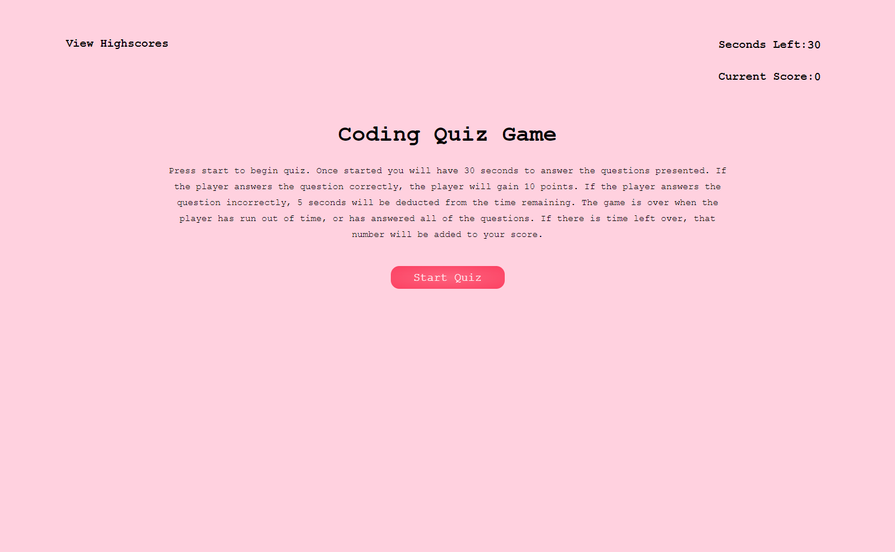
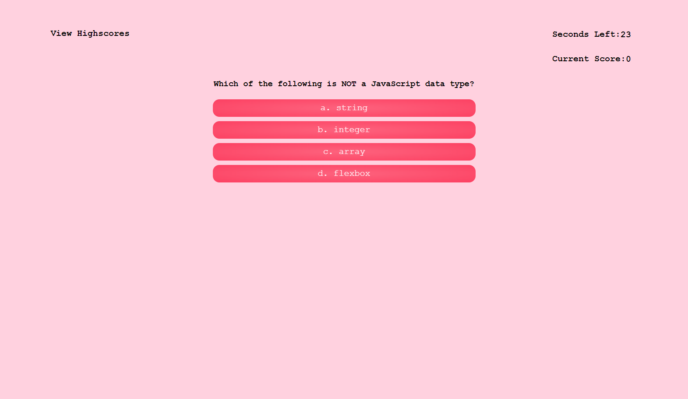
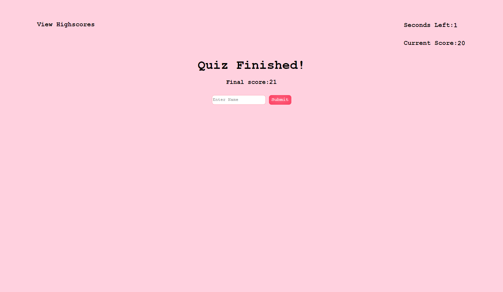
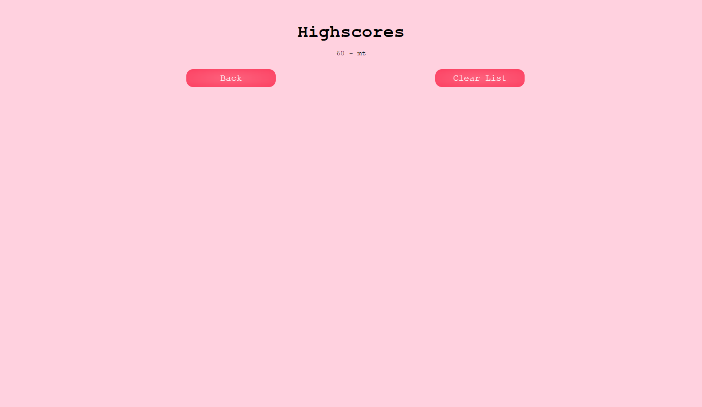

# Mod4-Code-Quiz

## Description

For this assignment, I was tasked with creating a timed quiz on JavaScript fundamentals from scratch. When the start button is pressed, a timer will start counting down from 30 seconds and the user will be presented with a question. When the user answers the question, a result will display telling the player if they answered the question correctly and another question will be presented. The game will end when the timer ends, or the user answers all of the questions. For each correctly answered question, the user will gain 10 points. Additionally, if the user answers the question incorrectly, 5 seconds will be subtracted from the time remaining. Once the game ends, the user will be prompted to input their name to save their score onto the leaderboard. 

## Installation

N/A

## Usage
Github: https://github.com/michelletrn/Mod4-Code-Quiz.git
Deployed URL: https://michelletrn.github.io/Mod4-Code-Quiz/

Here is a screenshot of my application:

## Credits

N/A

## License

N/A
